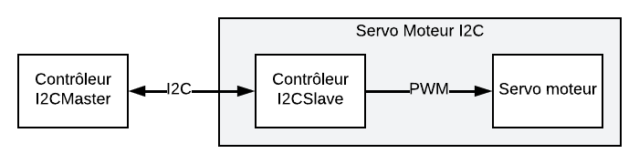

# Servo-Moteur-I2C

Le projet qui consiste à dévelepper un contrôleur pour commander un servo moteur à l'aide une interface I2C : Le moteur se rend à la position demandée par le message I2C.

Le **Servo Moteur I2C** est composé d'un servo-moteur HS-422 (ou équivalent) et d'une carte de développement Nucléo 64 F072RB. On pourra utiliser la carte LPC1768 (ou n'importe quelle autre carte I2C) pour jouer le rôle du Contrôleur I2C.

## Fonctionnement

Le **Servo Moteur I2C** reçoit des commandes codées sur 8 bits signés via son bus I2C. Ensuite, il génère le signal PWM nécessaire pour commander le moteur.

Les commandes possibles sont :

- De `-90` à `+90` : Positionner le moteur à la position demandée en °
- `126` : Démarrer le signal PWM et aller à la position centrale
- `127` : Arrêter le signal PWM
- Toutes les autres valeurs ne font rien

## Test :

Pour vérifier le bon fonctionnement, exécuter la séquence de test suivante avec une pause de `500 ms` entre chaque action :

1) Arrêter le signal PWM
2) Démarrer le signal PWM et aller à la position centrale
3) Aller à la position -90° 
4) Aller à la position -45°
5) Aller à la position +45°
6) Aller à la position 0°
7) Aller à la position +90° 
8) Aller à la position +135° (Le moteur ne devrait pas bouger) 
9) Aller à la position 0°
10) Arrêter le signal PWM

Il faudra utiliser un analyseur logique ou un oscilloscope pour confirmer la 1ère et la dernière étape.
