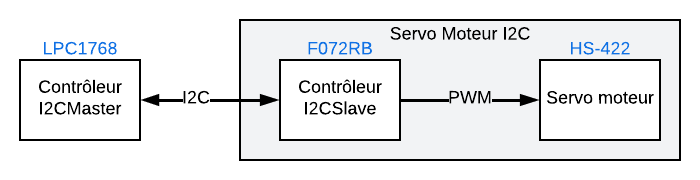

# Servo-Moteur-I2C

Le projet qui consiste à dévelepper un contrôleur pour commander un servo moteur à l'aide une interface I2C : Le moteur se rend à la position demandée par le message I2C.

Le **Servo Moteur I2C** est composé d'un servo-moteur HS-422 (ou équivalent) et d'une carte de développement Nucléo 64 F072RB. On pourra utiliser la carte LPC1768 (ou n'importe quelle autre carte I2C) pour jouer le rôle du Contrôleur I2C.

## Fonctionnement

Le **Servo Moteur I2C** reçoit des commandes codées sur 8 bits signés via son bus I2C. Ensuite, il génère le signal PWM nécessaire pour commander le moteur.

Lorsque le périphérique reçoit des commandes en écriture, il doit réagir de la manière suivante :

- De `-90` à `+90` : Positionner le moteur à la position demandée en °
- `126` : Démarrer le signal PWM et aller à la position centrale
- `127` : Arrêter le signal PWM
- Toutes les autres valeurs ne font rien

Lorsque le périphérique reçoit des commandes en lecture, il doit renvoyer sont état sous forme de chaîne de caractères ASCII :
- `-90` à `+90` si le moteur est en fonctionnement
- `OFF` si le PWM est désactivé

## Test :

Pour vérifier le bon fonctionnement, exécuter la séquence de test suivante avec une pause de `500 ms` entre chaque action :

1) Arrêter le signal PWM
2) Démarrer le signal PWM et aller à la position centrale
3) Aller à la position -90° 
4) Demander l'état du moteur
5) Aller à la position -45°
6) Aller à la position +45°
7) Aller à la position 0°
8) Demander l'état du moteur
9) Aller à la position +90° 
10) Aller à la position +135° (Le moteur ne devrait pas bouger) 
11) Demander l'état du moteur
12) Aller à la position 0°
13) Arrêter le signal PWM
14) Demander l'état du moteur

Il faudra utiliser un analyseur logique ou un oscilloscope pour confirmer l'arrêt du signal PWM.
